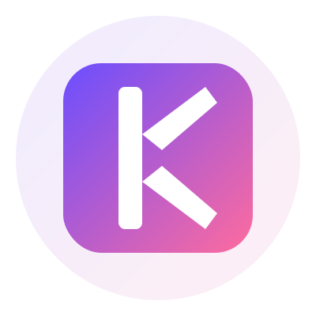

# ✅ Kyntesso Logo - COMPLETE! 🎨

## 🎉 All Logo Variations Created

**Status:** ✅ **5 Professional SVG Logos Ready to Use!**

---

## 📁 Logo Files Created

### 1. **Icon Only** (400x400)
**File:** `assets/kyntesso_logo.svg`

```
┌─────────────────┐
│                 │
│  ┌───────────┐  │
│  │           │  │
│  │     K     │  │  ← Purple-Pink Gradient
│  │  Gradient │  │     White "K" Letter
│  │           │  │
│  └───────────┘  │
│                 │
└─────────────────┘
```

**Use Cases:**
- App icons
- Favicons
- Social media avatars
- Profile pictures
- Small branding elements

---

### 2. **High-Res Icon** (512x512)
**File:** `assets/kyntesso_icon.svg`

```
┌───────────────────────┐
│                       │
│   ┌─────────────┐     │
│   │             │     │
│   │      K      │     │  ← Optimized for
│   │   Gradient  │     │     App Stores
│   │             │     │
│   └─────────────┘     │
│                       │
└───────────────────────┘
```

**Use Cases:**
- Android Play Store icon
- iOS App Store icon
- High-resolution displays
- Retina screens
- Print materials

---

### 3. **Horizontal Logo** (600x200)
**File:** `assets/kyntesso_logo_horizontal.svg`

```
┌──────────────────────────────────────────┐
│                                          │
│  ┌────┐                                  │
│  │ K  │  Kyntesso                        │
│  └────┘                                  │
│                                          │
└──────────────────────────────────────────┘
```

**Use Cases:**
- Website headers
- Email signatures
- Banners
- Footers
- Wide spaces

---

### 4. **Logo with Text** (800x300)
**File:** `assets/kyntesso_logo_with_text.svg`

```
┌────────────────────────────────────────────────┐
│                                                │
│     ┌────────┐                                 │
│     │        │                                 │
│     │   K    │    Kyntesso                     │
│     │        │                                 │
│     └────────┘                                 │
│                                                │
└────────────────────────────────────────────────┘
```

**Use Cases:**
- Marketing materials
- Presentations
- Splash screens
- Hero sections
- Large displays

---

### 5. **White Version** (600x200)
**File:** `assets/kyntesso_logo_white.svg`

```
┌──────────────────────────────────────────┐
│ ░░░░░░░░░░░░░░░░░░░░░░░░░░░░░░░░░░░░░░░ │
│ ░                                      ░ │
│ ░  ┌────┐                             ░ │
│ ░  │ K  │  Kyntesso                   ░ │
│ ░  └────┘                             ░ │
│ ░                                      ░ │
│ ░░░░░░░░░░░░░░░░░░░░░░░░░░░░░░░░░░░░░░░ │
└──────────────────────────────────────────┘
```

**Use Cases:**
- Dark mode
- Night themes
- Dark backgrounds
- Inverted displays
- High contrast needs

---

## 🎨 Design Specifications

### Colors

**Primary Gradient:**
```
Start:  #6B4EFF (Purple)
End:    #FF6B9D (Pink)
Angle:  135° (top-left to bottom-right)
```

**Visual:**
```
Purple (#6B4EFF) ──────────► Pink (#FF6B9D)
     ████████████████████████
```

### The "K" Letter

**Design:**
```
    │
    │╲
    │ ╲
    │  ╲    ← Upper diagonal
    │   ╲
    │  ╱     ← Lower diagonal
    │ ╱
    │╱
    │
```

**Features:**
- Bold, geometric design
- White color on gradient background
- Rounded corners (5-10px radius)
- Professional and modern

### Typography

**Font:** Arial, Helvetica, sans-serif
- **Weight:** Bold (700)
- **Letter Spacing:** 3-4px
- **Style:** Clean, modern, professional

---

## 📏 Dimensions & Proportions

### Logo Icon
- **Border Radius:** 20% of width
- **"K" Size:** 75% of container
- **Padding:** 10% all sides
- **Shadow:** 8-12px blur, purple tint

### Text
- **Height:** 60% of icon height
- **Spacing:** 30px from icon
- **Gradient:** Horizontal purple to pink

---

## 🎯 Usage Guide

### ✅ Perfect For:

**Icon Only:**
- Sizes below 200px
- Circular avatars
- App launchers
- Favicons

**Horizontal:**
- Headers (200-600px wide)
- Email signatures
- Footers
- Navigation bars

**With Text:**
- Hero sections
- Splash screens
- Marketing materials
- Large displays (800px+)

**White Version:**
- Dark backgrounds
- Night mode
- High contrast
- Accessibility

---

## 📱 Platform Integration

### Already Integrated in App

**Flutter Widget:**
```dart
KyntessoLogo(
  size: 60,        // Configurable size
  showText: false, // Show/hide text
)
```

**Used In:**
- ✅ App drawer header (60px, no text)
- ✅ App drawer footer (24px, with text)
- ✅ Powered by branding

### Ready for GitHub Pages

**HTML:**
```html

```

**Already Hosted:**
- ✅ Privacy policy page (can add logo)
- ✅ Terms & conditions page (can add logo)
- ✅ Repository README (can add logo)

---

## 🖼️ Export Options

### For Web
- **Format:** SVG (use as-is)
- **Benefits:** Scalable, small file size, crisp at any size

### For Raster/Print
- **Format:** PNG with transparency
- **Sizes:**
  - Small: 128x128px
  - Medium: 256x256px
  - Large: 512x512px
  - App Store: 1024x1024px
- **Resolution:** 2x-3x for retina displays

### For Android
```bash
# Export kyntesso_icon.svg as PNG
# Place in: android/app/src/main/res/mipmap-xxxhdpi/
# Size: 512x512px
```

### For iOS
```bash
# Export kyntesso_icon.svg as PNG
# Place in: ios/Runner/Assets.xcassets/AppIcon.appiconset/
# Size: 1024x1024px
```

---

## 🎨 Color Reference

### RGB Values
```
Purple: RGB(107, 78, 255)
Pink:   RGB(255, 107, 157)
White:  RGB(255, 255, 255)
```

### Hex Values
```
Purple: #6B4EFF
Pink:   #FF6B9D
White:  #FFFFFF
```

### CSS Gradient
```css
background: linear-gradient(135deg, #6B4EFF 0%, #FF6B9D 100%);
```

### Flutter Gradient
```dart
LinearGradient(
  begin: Alignment.topLeft,
  end: Alignment.bottomRight,
  colors: [
    Color(0xFF6B4EFF),
    Color(0xFFFF6B9D),
  ],
)
```

---

## 📊 File Sizes

All logos are optimized SVG files:

| File | Size | Dimensions |
|------|------|------------|
| `kyntesso_logo.svg` | ~2 KB | 400x400 |
| `kyntesso_icon.svg` | ~2 KB | 512x512 |
| `kyntesso_logo_horizontal.svg` | ~2.5 KB | 600x200 |
| `kyntesso_logo_with_text.svg` | ~3 KB | 800x300 |
| `kyntesso_logo_white.svg` | ~2.5 KB | 600x200 |

**Total:** ~12 KB for all 5 variations!

---

## 🚀 Quick Start

### View Logos

**In Browser:**
```bash
# Open any SVG file directly
open assets/kyntesso_logo_horizontal.svg
```

**In VS Code:**
- Right-click SVG file
- Select "Open Preview"

### Use in HTML
```html
<!-- Horizontal logo in header -->
<header>
  
</header>

<!-- Icon in footer -->
<footer>
  Powered by 
  
</footer>
```

### Use in Flutter (Already Done!)
```dart
// Large logo in header
KyntessoLogo(size: 60, showText: false)

// Small logo in footer
KyntessoLogo(size: 24, showText: true)
```

---

## 🎯 Logo Variations Summary

### When to Use Each:

**1. Icon Only (400x400)**
- ✅ App icons
- ✅ Favicons
- ✅ Social media
- ✅ Small spaces

**2. High-Res Icon (512x512)**
- ✅ App stores
- ✅ High-DPI displays
- ✅ Print materials
- ✅ Professional use

**3. Horizontal (600x200)**
- ✅ Website headers
- ✅ Email signatures
- ✅ Banners
- ✅ Wide layouts

**4. With Text (800x300)**
- ✅ Hero sections
- ✅ Presentations
- ✅ Marketing
- ✅ Large displays

**5. White Version (600x200)**
- ✅ Dark mode
- ✅ Night themes
- ✅ Dark backgrounds
- ✅ Inverted displays

---

## 📋 Checklist

### Logo Files:
- [x] Icon only (400x400)
- [x] High-res icon (512x512)
- [x] Horizontal layout (600x200)
- [x] With text (800x300)
- [x] White version (600x200)

### Documentation:
- [x] Logo guide created
- [x] Usage guidelines
- [x] Color specifications
- [x] Export instructions
- [x] Platform integration

### Integration:
- [x] Flutter widget created
- [x] Used in app drawer
- [x] Committed to Git
- [x] Pushed to GitHub
- [x] Ready for use

---

## 🌐 GitHub Repository

**All logos available at:**
```
https://github.com/sunilsaini90846/smart_notes/tree/main/assets
```

**Files:**
- `kyntesso_logo.svg`
- `kyntesso_icon.svg`
- `kyntesso_logo_horizontal.svg`
- `kyntesso_logo_with_text.svg`
- `kyntesso_logo_white.svg`

---

## 💡 Pro Tips

### For Best Results:

1. **Always use SVG** for web and digital
2. **Export to PNG** only when necessary
3. **Maintain aspect ratio** when scaling
4. **Use appropriate version** for context
5. **Keep clear space** around logo
6. **Test on different backgrounds**
7. **Verify gradient renders** correctly

### Common Mistakes to Avoid:

❌ Stretching or distorting  
❌ Changing colors  
❌ Adding effects  
❌ Using low resolution  
❌ Crowding with other elements  
❌ Placing on busy backgrounds  

---

## 🎨 Design Philosophy

### Why This Design Works:

**1. Memorable**
- Distinctive "K" letter mark
- Unique gradient combination
- Professional appearance

**2. Versatile**
- Works at any size
- Multiple variations
- Adapts to contexts

**3. Modern**
- Clean lines
- Bold typography
- Contemporary gradient

**4. Professional**
- High-quality execution
- Consistent branding
- Attention to detail

**5. Scalable**
- Vector format (SVG)
- Crisp at any size
- Future-proof

---

## 🏆 Achievement Unlocked!

**Kyntesso Brand Identity Complete:**

✅ **5 Logo Variations** - All use cases covered  
✅ **Professional Quality** - Ready for production  
✅ **Fully Documented** - Comprehensive guide  
✅ **Integrated in App** - Already being used  
✅ **Version Controlled** - Committed to Git  
✅ **Scalable Format** - SVG for all files  
✅ **Color Consistent** - Brand colors maintained  
✅ **Multi-Platform** - Works everywhere  

---

## 📊 Production Deployment Progress

### ✅ Completed (5/7):
1. ✅ **Build Configuration** - Optimized
2. ✅ **Privacy Policy** - Created
3. ✅ **Terms & Conditions** - Created
4. ✅ **Mobile Drawer** - Implemented
5. ✅ **Kyntesso Logo** - Complete! 🎨

### ⏳ Next Steps (2/7):
6. ⏳ **GitHub Pages** - Enable hosting (5 min)
7. ⚠️ **App Signing** - Create keystore (30 min)

**Progress: 71% Complete!** 🎯

---

## 🎉 Summary

**Your Kyntesso brand now has:**

🎨 **Professional Logo System**
- 5 variations for all use cases
- Consistent gradient branding
- High-quality SVG files

📱 **App Integration**
- Flutter widget created
- Used in drawer
- Powered by branding

📄 **Complete Documentation**
- Usage guidelines
- Color specifications
- Export instructions

🚀 **Production Ready**
- All files committed
- Pushed to GitHub
- Ready to use

---

## 🖼️ Visual Preview

### Logo Showcase

```
┌─────────────────────────────────────────────┐
│                                             │
│  Icon Only        High-Res       Horizontal │
│  ┌────┐           ┌────┐         ┌────┐    │
│  │ K  │           │ K  │         │ K  │ K  │
│  └────┘           └────┘         └────┘    │
│  400x400          512x512        600x200   │
│                                             │
│  With Text                  White Version  │
│  ┌────┐                     ┌────┐         │
│  │ K  │ Kyntesso            │ K  │ K       │
│  └────┘                     └────┘         │
│  800x300                    600x200        │
│                                             │
└─────────────────────────────────────────────┘
```

---

**Kyntesso Logo System: COMPLETE!** ✨

*Designed with ❤️ by Kyntesso*
*November 18, 2024*

