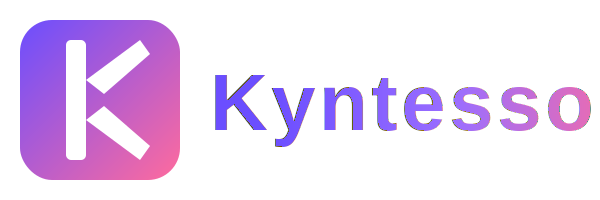
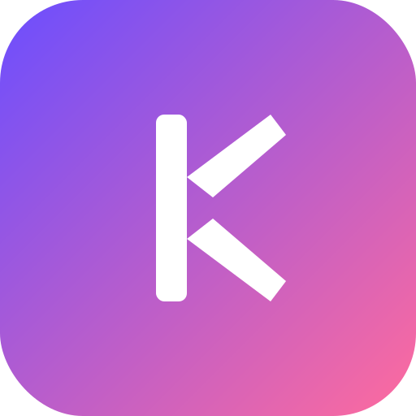

# 🎨 Kyntesso Logo Design Guide

## ✅ Logo Files Created

All SVG logo files have been created in the `assets/` folder!

---

## 📁 Logo Variations

### 1. **Icon Only** - `kyntesso_logo.svg`
- **Size:** 400x400px
- **Use:** App icons, favicons, social media avatars
- **Features:** Square gradient background with white "K"
- **Best for:** Small sizes, profile pictures

### 2. **Icon (512x512)** - `kyntesso_icon.svg`
- **Size:** 512x512px
- **Use:** High-resolution app icons, Android launcher icons
- **Features:** Optimized for app stores
- **Best for:** Play Store, App Store icons

### 3. **Horizontal Logo** - `kyntesso_logo_horizontal.svg`
- **Size:** 600x200px
- **Use:** Headers, website banners, email signatures
- **Features:** Icon + "Kyntesso" text side by side
- **Best for:** Wide spaces, headers, footers

### 4. **Logo with Text** - `kyntesso_logo_with_text.svg`
- **Size:** 800x300px
- **Use:** Marketing materials, presentations, splash screens
- **Features:** Large icon with prominent text
- **Best for:** Hero sections, presentations

### 5. **White Version** - `kyntesso_logo_white.svg`
- **Size:** 600x200px
- **Use:** Dark backgrounds, night mode
- **Features:** White background with gradient "K"
- **Best for:** Dark themes, inverted displays

---

## 🎨 Design Specifications

### Color Palette

**Primary Gradient:**
- Start: `#6B4EFF` (Purple)
- End: `#FF6B9D` (Pink)
- Direction: Top-left to bottom-right (135°)

**Secondary Colors:**
- White: `#FFFFFF` (for "K" letter)
- Mid-gradient: `#9B6EFF` (for text gradient)

### Typography

**Font:** Arial, Helvetica, sans-serif (Bold)
- **Fallback:** System sans-serif
- **Weight:** Bold (700)
- **Letter Spacing:** 3-4px
- **Style:** Modern, clean, professional

### Dimensions

**Logo Icon:**
- Border Radius: 20% of width (e.g., 40px for 200px width)
- "K" Letter: 75% of container height
- Padding: 10% on all sides

**Text:**
- Height: ~60% of icon height
- Spacing from icon: 30px minimum

---

## 📐 Logo Construction

### The "K" Letter

```
┌─────────────┐
│             │
│  │╲         │  ← Upper diagonal
│  │ ╲        │
│  │  ╲       │
│  │   ╲      │
│  │    ╲     │
│  │   ╱      │  ← Lower diagonal
│  │  ╱       │
│  │ ╱        │
│  │╱         │
│             │
└─────────────┘
```

**Components:**
1. **Vertical Bar:** Left side, full height
2. **Upper Diagonal:** From middle to top-right
3. **Lower Diagonal:** From middle to bottom-right

**Proportions:**
- Vertical bar width: 15-20% of icon width
- Diagonal thickness: Same as vertical bar
- Rounded corners: 5-8px radius

---

## 🎯 Usage Guidelines

### ✅ DO:

1. **Maintain Aspect Ratio**
   - Always scale proportionally
   - Never stretch or squish

2. **Use Appropriate Version**
   - Icon for small spaces
   - Horizontal for wide spaces
   - White version on dark backgrounds

3. **Maintain Clear Space**
   - Minimum padding: 10% of logo size
   - Keep area around logo clear

4. **Use High Resolution**
   - SVG for web and digital
   - Export to PNG at 2x-3x for raster

5. **Respect Colors**
   - Use exact gradient values
   - Maintain gradient direction

### ❌ DON'T:

1. **Don't Modify Colors**
   - No color changes
   - No single-color versions (except white)
   - No gradient alterations

2. **Don't Distort**
   - No stretching
   - No skewing
   - No rotating (except 90° increments)

3. **Don't Add Effects**
   - No drop shadows (already included)
   - No outlines or borders
   - No 3D effects

4. **Don't Crowd**
   - Maintain clear space
   - Don't place too close to edges
   - Don't overlap with other elements

5. **Don't Recreate**
   - Always use provided files
   - Don't redraw or trace
   - Don't use low-quality versions

---

## 📱 Platform-Specific Usage

### Android App Icon
**File:** `kyntesso_icon.svg`
- Export as PNG: 512x512px
- Place in: `android/app/src/main/res/mipmap-xxxhdpi/`
- Adaptive icon: Use with white background

### iOS App Icon
**File:** `kyntesso_icon.svg`
- Export as PNG: 1024x1024px
- Place in: `ios/Runner/Assets.xcassets/AppIcon.appiconset/`
- No transparency needed

### Web Favicon
**File:** `kyntesso_icon.svg`
- Export as PNG: 32x32px, 64x64px, 128x128px
- Also save as ICO format
- Place in: `web/` folder

### Social Media

**Profile Picture:**
- Use: `kyntesso_logo.svg` (400x400)
- Export: 500x500px PNG

**Cover Photo:**
- Use: `kyntesso_logo_horizontal.svg`
- Export: Platform-specific dimensions

**Open Graph:**
- Use: `kyntesso_logo_with_text.svg`
- Export: 1200x630px PNG

---

## 🖼️ Export Guidelines

### For Web (SVG)
```bash
# Use as-is, no export needed

```

### For Raster (PNG)

**High Quality:**
- Resolution: 2x-3x display size
- Format: PNG-24 with transparency
- Color Space: sRGB

**Example Sizes:**
- Small icon: 128x128px
- Medium icon: 256x256px
- Large icon: 512x512px
- App Store: 1024x1024px

### For Print

**Requirements:**
- Format: PDF or high-res PNG
- Resolution: 300 DPI minimum
- Color Space: CMYK (convert from RGB)
- Size: Actual print size

---

## 🎨 Color Variations

### Primary (Gradient)
```
Purple: #6B4EFF
Pink:   #FF6B9D
```
**Use:** Main logo, digital displays

### White on Dark
```
Background: White #FFFFFF
K Letter:   Gradient (#6B4EFF → #FF6B9D)
```
**Use:** Dark mode, night themes

### Monochrome (Emergency Only)
```
Single Color: #6B4EFF or #FF6B9D
```
**Use:** When gradient not possible

---

## 📏 Minimum Sizes

### Digital
- **Icon Only:** 32x32px minimum
- **With Text:** 120px height minimum
- **Horizontal:** 200px width minimum

### Print
- **Icon Only:** 0.5 inch / 1.27 cm
- **With Text:** 1.5 inch / 3.81 cm
- **Horizontal:** 2 inch / 5.08 cm

**Below these sizes:** Use icon only, no text

---

## 🔧 Technical Specifications

### SVG Properties
```xml
<!-- Gradient Definition -->
<linearGradient id="mainGradient" x1="0%" y1="0%" x2="100%" y2="100%">
  <stop offset="0%" stop-color="#6B4EFF"/>
  <stop offset="100%" stop-color="#FF6B9D"/>
</linearGradient>

<!-- Border Radius -->
rx="20%" ry="20%"  /* 20% of width/height */

<!-- Shadow -->
<feDropShadow dx="0" dy="8" stdDeviation="12" 
              flood-color="#6B4EFF" flood-opacity="0.4"/>
```

### CSS Usage
```css
.kyntesso-logo {
  background: linear-gradient(135deg, #6B4EFF 0%, #FF6B9D 100%);
  border-radius: 20%;
  box-shadow: 0 8px 24px rgba(107, 78, 255, 0.4);
}
```

---

## 📦 File Organization

```
assets/
├── kyntesso_logo.svg              # 400x400 icon
├── kyntesso_icon.svg              # 512x512 high-res icon
├── kyntesso_logo_horizontal.svg   # 600x200 horizontal
├── kyntesso_logo_with_text.svg    # 800x300 large
└── kyntesso_logo_white.svg        # 600x200 white version
```

---

## 🎯 Quick Reference

| Use Case | File | Size |
|----------|------|------|
| App Icon | `kyntesso_icon.svg` | 512x512 |
| Favicon | `kyntesso_icon.svg` | 32x32 |
| Header | `kyntesso_logo_horizontal.svg` | 600x200 |
| Hero Section | `kyntesso_logo_with_text.svg` | 800x300 |
| Dark Mode | `kyntesso_logo_white.svg` | 600x200 |
| Social Media | `kyntesso_logo.svg` | 400x400 |
| Email Signature | `kyntesso_logo_horizontal.svg` | 300x100 |

---

## 🌈 Brand Colors Reference

### Primary Palette
```
Purple:     #6B4EFF  RGB(107, 78, 255)
Pink:       #FF6B9D  RGB(255, 107, 157)
Mid-Purple: #9B6EFF  RGB(155, 110, 255)
```

### Supporting Colors
```
White:      #FFFFFF  RGB(255, 255, 255)
Dark BG:    #0F0F1E  RGB(15, 15, 30)
Surface:    #1A1A2E  RGB(26, 26, 46)
```

### Gradient CSS
```css
/* Main Gradient */
background: linear-gradient(135deg, #6B4EFF 0%, #FF6B9D 100%);

/* Text Gradient */
background: linear-gradient(90deg, #6B4EFF 0%, #9B6EFF 50%, #FF6B9D 100%);
-webkit-background-clip: text;
-webkit-text-fill-color: transparent;
```

---

## 🖨️ Print Specifications

### CMYK Values
```
Purple (#6B4EFF):
  C: 58%  M: 69%  Y: 0%   K: 0%

Pink (#FF6B9D):
  C: 0%   M: 58%  Y: 38%  K: 0%
```

### Pantone Equivalents
```
Purple: Pantone 2665 C (closest match)
Pink:   Pantone 1915 C (closest match)
```

---

## 🎨 Logo Mockups

### On White Background
```
┌─────────────────────────────┐
│                             │
│   [Purple-Pink Gradient]    │
│        [K] Kyntesso         │
│                             │
└─────────────────────────────┘
```

### On Dark Background
```
┌─────────────────────────────┐
│ ░░░░░░░░░░░░░░░░░░░░░░░░░░░ │
│ ░  [Purple-Pink Gradient]  ░ │
│ ░       [K] Kyntesso       ░ │
│ ░░░░░░░░░░░░░░░░░░░░░░░░░░░ │
└─────────────────────────────┘
```

### In App Drawer
```
┏━━━━━━━━━━━━━━━━━━━━━━━━━━┓
┃                          ┃
┃      [K Logo 60px]       ┃
┃   Account Note Book      ┃
┃  Secure Notes Manager    ┃
┃                          ┃
┣━━━━━━━━━━━━━━━━━━━━━━━━━━┫
┃      Powered by          ┃
┃    [K] Kyntesso          ┃  ← 24px horizontal
┗━━━━━━━━━━━━━━━━━━━━━━━━━━┛
```

---

## 🚀 Implementation Examples

### HTML
```html
<!-- Horizontal Logo -->


<!-- Icon Only -->

```

### Flutter (Already Implemented)
```dart
// Using the KyntessoLogo widget
KyntessoLogo(
  size: 60,
  showText: false,
)

// With text
KyntessoLogo(
  size: 40,
  showText: true,
)
```

### CSS Background
```css
.logo-container {
  background-image: url('assets/kyntesso_logo.svg');
  background-size: contain;
  background-repeat: no-repeat;
  background-position: center;
}
```

---

## 📋 Logo Checklist

### Before Using:
- [ ] Choose appropriate version (icon/horizontal/with text)
- [ ] Check background color compatibility
- [ ] Verify size is above minimum
- [ ] Ensure clear space around logo
- [ ] Use correct file format (SVG for web, PNG for raster)

### After Placing:
- [ ] Logo is clearly visible
- [ ] Colors display correctly
- [ ] Gradient renders properly
- [ ] No distortion or stretching
- [ ] Adequate padding/spacing

---

## 🎉 Logo Features

### ✅ Strengths:
- **Modern & Clean:** Contemporary design
- **Memorable:** Distinctive "K" letter mark
- **Scalable:** Vector format (SVG)
- **Versatile:** Multiple variations
- **Professional:** Gradient adds depth
- **Recognizable:** Works at any size

### 🎨 Design Elements:
- **Gradient:** Purple to pink (brand colors)
- **Shape:** Rounded square (friendly, modern)
- **Letter:** Bold "K" (strong, confident)
- **Shadow:** Subtle depth (premium feel)
- **Typography:** Bold sans-serif (professional)

---

## 📞 Support

For logo-related questions or custom variations:
- **Repository:** https://github.com/sunilsaini90846/smart_notes
- **Location:** `/assets/` folder
- **Format:** SVG (scalable vector graphics)

---

## ✨ Summary

**5 Logo Variations Created:**
1. ✅ `kyntesso_logo.svg` - 400x400 icon
2. ✅ `kyntesso_icon.svg` - 512x512 high-res
3. ✅ `kyntesso_logo_horizontal.svg` - Horizontal layout
4. ✅ `kyntesso_logo_with_text.svg` - Large with text
5. ✅ `kyntesso_logo_white.svg` - White version

**All files are:**
- ✅ SVG format (scalable)
- ✅ Gradient colors (#6B4EFF → #FF6B9D)
- ✅ Professional quality
- ✅ Ready to use
- ✅ Optimized for web and print

---

**Your Kyntesso brand identity is complete!** 🎨✨

*Designed with ❤️ by Kyntesso*
*November 18, 2024*

